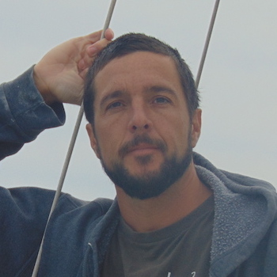

My name is Dr. Marko A. Rodriguez. I focus my time and energy in various areas of the <a href="http://en.wikipedia.org/wiki/Graph_database">graph computing</a> space. The <a href="http://en.wikipedia.org/wiki/Graph_%28mathematics%29">graph</a> is a structure that represents vertices (nodes, dots) and edges (links, lines). Over the last decade, the graph computing space has seen an increase in developers, vendors and users. The reason why people are excited about graphs in the context of data management and processing is because they are realizing that many problems can be represented as a graph and solved efficiently using graph traversal techniques. No longer are graphs relegated to mathematical inquiry. This previously underutilized, fundamental data structure is now applied to numerous engineering problems.
